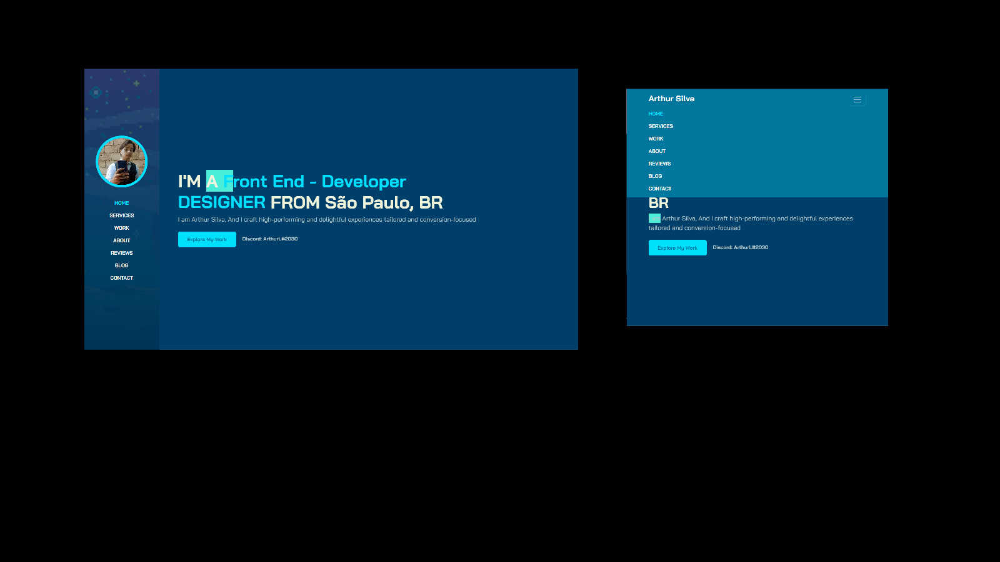

<h1 align="center"> 
    Portfolio with Bootstrap
</h1>

  <a href="#-About">About</a>&nbsp;&nbsp;&nbsp;|&nbsp;&nbsp;&nbsp;
  <a href="#-Project">Project</a>&nbsp;&nbsp;&nbsp;|&nbsp;&nbsp;&nbsp;
  <a href="#-Technology">Technology</a>

    

<h5 style="text-align: center"> Img portfolio </h5>

## 📚 About

Este repositório foi dedicado a mostrar meu aprendizado em conhecimento com _**Bootstrap**_ e _**CSS**_: Portfólio com _**Bootstrap**_. Mesmo ter sido uma pessoa que começou com CSS/Sass com esse projeto, observei o quanto é vantajoso e útil a utilização do _**Bootstrap**_ seja em um projeto pessoal, acadêmico, ou profissional. Nesse projeto explorei coisas do Js que não tinha conhecimento, além de aprender mais sobre como utilizar a _**responsividade**_ e _**animações**_ do _**CSS**_.

Para ter acesso a conteúdo similares, acesse: *([CodePen](https://codepen.io/))*

## 💻 Project

O projeto **Portfolio with Bootstrap** foi utilizado a partir da **IDE**:

- VSCode ( Visual Studio Code )

## 🚀 Technology

O projeto foi desenvolvido a partir das tecnologias:

- *HTML5*
- *CSS3*
- *BOOTSTRAP*
- *JAVASCRIPT*

## ​:dizzy: Material Bônus / Bonus Material

- *Icones/Icons* ([Icons](https://feathericons.com/))
- *Paleta de cores/Color Palette* ([PaletaCores](https://paletadecores.com/))

## 📚 About

This repository was dedicated to showing my learning in knowledge with _**Bootstrap**_ and _**CSS**_: Portfolio with _**Bootstrap**_. Even though I was a person who started with CSS/Sass with this project, I noticed how advantageous and useful it is to use _**Bootstrap**_ whether in a personal, academic, or professional project. In this project I explored things about Js that I didn't know about, in addition to learning more about how to use the _**responsiveness**_ and _**animations**_ of _**CSS**_.

To access similar content, go to: *([CodePen](https://codepen.io/))*

## 💻 Project

The project **Recreating the Instagram interface** was used from the **IDE**:

- *VSCode ( Visual Studio Code )*

## 🚀 Technologies Used:

*The project was developed based on technologies:*

- *HTML5*
- *CSS3*
- *BOOTSTRAP*
- *JAVASCRIPT*

--------------

Developed by :atom_symbol: [**Arthur Silva**]([arthursj (ArthurSilva) (github.com)](https://github.com/arthursj))
